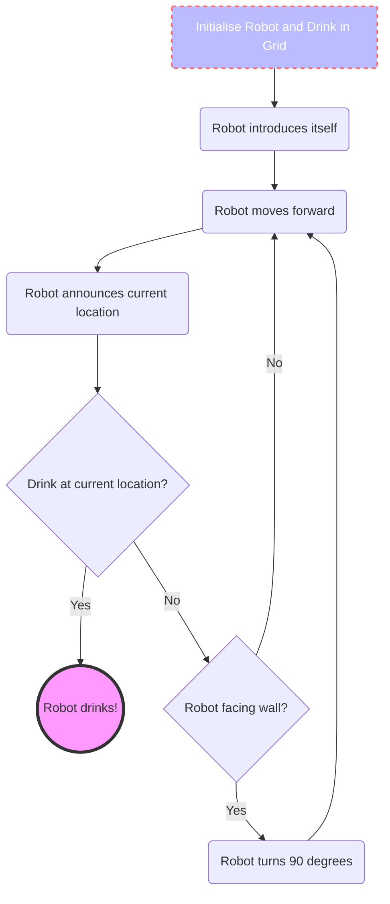

# Robot

This is code for the Robot from Josiah Wang's Python Introduction tutorials at Imperial College London. It is a toy example that initiates a robot and allows it to navigate through a square grid for a target (drink). This was largely used to learn about Object-Oriented Programming (OOP).

## Process flow

The path followed by a normal robot is displayed below:


## Files included


1. **robot.py**: This contains the Robot class

2. **LeapingRobot.py** : This contains the LeapingRobot super class

3. **grid.py**: This contains the grid class

4. **drink.py**: This contains the drinks class

5. **robot_init.py**: This contains the RobotFactory class for generating multiple robot names

6. **robot_names.txt**: List of names for random selection to assign a robot a name

7. **drink_names.txt**: List of names for random selection to assign a target drink a name

8. **NavigationManager.py**: This contains the drinks class

9. **BattleRobot.py**: This contains the BattleRobot class

## Run Locally

Clone the project

```bash
  git clone https://github.com/Uokoroafor/robot.git
```

Go to the project directory

```bash
  cd Robot
```


## Usage/Examples

```python
# Imports: Please first run the commands. Note that running these commands will automatically import numpy as np and numpy.random as default rng. This allows for seeding randomness if required:
from NavigationManager import move_all_to_drink
from grid import Grid
from drink import Drink
from robot import Robot

# Initialise a 5x5 grid
my_grid=Grid(5)

# Generate a drink
targetdrink=Drink()

# Generate a robot with a particular name, 
Terminator = Robot(name='Arnie', identifier='T800', position=(3,3), direction='e')


# Use the NavigationManager to generate 3 robots and navigate them around the grid
move_all_to_drink(robot_count=3, grid=my_grid, delay=True)
```

### Sample Output

```console
optimus is looking for its drink.
My current location is ((0, 3)), facing East
Initial setup of grid

  | 0 | 1 | 2 | 3 | 4 | 
------------------------
|0| * | * | * | R | * | 
------------------------
|1| * | * | * | * | * | 
------------------------
|2| * | * | * | * | * | 
------------------------
|3| * | * | * | * | * | 
------------------------
|4| * | * | * | * | D | 
------------------------
Moving one step forward.
My current location is ((0, 4)), facing East
  | 0 | 1 | 2 | 3 | 4 | 
------------------------
|0| * | * | * | * | R | 
------------------------
|1| * | * | * | * | * | 
------------------------
|2| * | * | * | * | * | 
------------------------
|3| * | * | * | * | * | 
------------------------
|4| * | * | * | * | D | 
------------------------
I have a wall in front of me!
Turning 90 degrees clockwise.
My current location is ((0, 4)), facing South.
Moving one step forward.
My current location is ((1, 4)), facing South
  | 0 | 1 | 2 | 3 | 4 | 
------------------------
|0| * | * | * | * | * | 
------------------------
|1| * | * | * | * | R | 
------------------------
|2| * | * | * | * | * | 
------------------------
|3| * | * | * | * | * | 
------------------------
|4| * | * | * | * | D | 
------------------------
Moving one step forward.
My current location is ((2, 4)), facing South
  | 0 | 1 | 2 | 3 | 4 | 
------------------------
|0| * | * | * | * | * | 
------------------------
|1| * | * | * | * | * | 
------------------------
|2| * | * | * | * | R | 
------------------------
|3| * | * | * | * | * | 
------------------------
|4| * | * | * | * | D | 
------------------------
Moving one step forward.
My current location is ((3, 4)), facing South
  | 0 | 1 | 2 | 3 | 4 | 
------------------------
|0| * | * | * | * | * | 
------------------------
|1| * | * | * | * | * | 
------------------------
|2| * | * | * | * | * | 
------------------------
|3| * | * | * | * | R | 
------------------------
|4| * | * | * | * | D | 
------------------------
Moving one step forward.
My current location is ((4, 4)), facing South
  | 0 | 1 | 2 | 3 | 4 | 
------------------------
|0| * | * | * | * | * | 
------------------------
|1| * | * | * | * | * | 
------------------------
|2| * | * | * | * | * | 
------------------------
|3| * | * | * | * | * | 
------------------------
|4| * | * | * | * | R | 
------------------------
I am now drinking Coffee and happy!
```